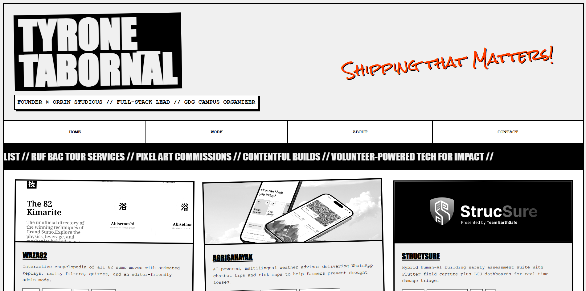

# brutalism_portfolio

Tiny, loud, and unapologetic. I whipped up this brutalist one-pager as a prerequisite for our web dev course—and because I wanted an excuse to ship something that looks like it crawled out of a zine.

## Features
- Pure HTML/CSS/JS (no frameworks, just vibes).
- Pagination for the six headline projects.
- Live system clock + marquee shouting my wins.
- Local OG splash (`images/splash_image.png`) for nice link previews.

## Run It
```
double-click index.html
```

Feel free to fork, remix, or just stare at the chunky typography.

